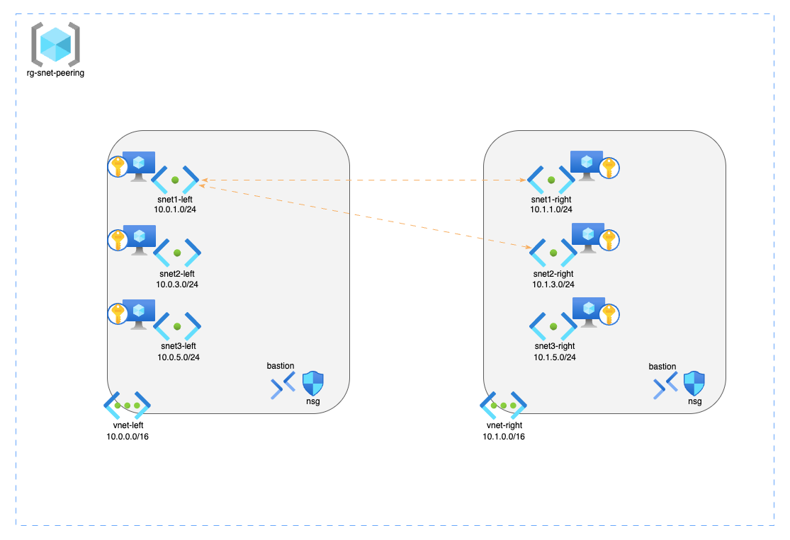

<!-- BEGIN_TF_DOCS -->

#### Requirements

| Name | Version |
|------|---------|
|  [terraform](#requirement\_terraform) | 1.12.2 |
|  [azapi](#requirement\_azapi) | 2.5.0 |
|  [azurerm](#requirement\_azurerm) | 4.41.0 |
|  [null](#requirement\_null) | 3.2.4 |
|  [random](#requirement\_random) | 3.7.2 |
|  [tls](#requirement\_tls) | 4.1.0 |

#### Providers

| Name | Version |
|------|---------|
|  [azurerm](#provider\_azurerm) | 4.41.0 |
|  [null](#provider\_null) | 3.2.4 |
|  [random](#provider\_random) | 3.7.2 |
|  [tls](#provider\_tls) | 4.1.0 |

#### Modules

| Name | Source | Version |
|------|--------|---------|
|  [bastion](#module\_bastion) | azure/avm-res-network-bastionhost/azurerm | 0.8.1 |
|  [kv](#module\_kv) | azure/avm-res-keyvault-vault/azurerm | 0.10.1 |
|  [nsg](#module\_nsg) | azure/avm-res-network-networksecuritygroup/azurerm | 0.5.0 |
|  [rg](#module\_rg) | azure/avm-res-resources-resourcegroup/azurerm | 0.2.1 |
|  [vm](#module\_vm) | azure/avm-res-compute-virtualmachine/azurerm | 0.19.3 |
|  [vm\_sku](#module\_vm\_sku) | azure/avm-utl-sku-finder/azapi | 0.3.0 |
|  [vnet](#module\_vnet) | azure/avm-res-network-virtualnetwork/azurerm | 0.10.0 |

#### Resources

| Name | Type |
|------|------|
| [null_resource.register_encryption_at_host_feature](https://registry.terraform.io/providers/hashicorp/null/3.2.4/docs/resources/resource) | resource |
| [null_resource.register_multiple_peering_feature](https://registry.terraform.io/providers/hashicorp/null/3.2.4/docs/resources/resource) | resource |
| [random_string.random_suffix](https://registry.terraform.io/providers/hashicorp/random/3.7.2/docs/resources/string) | resource |
| [tls_private_key.this](https://registry.terraform.io/providers/hashicorp/tls/4.1.0/docs/resources/private_key) | resource |
| [azurerm_client_config.current](https://registry.terraform.io/providers/hashicorp/azurerm/4.41.0/docs/data-sources/client_config) | data source |

#### Inputs

| Name | Description | Type | Default | Required |
|------|-------------|------|---------|:--------:|
|  [address\_space](#input\_address\_space) | Address spaces for both virtual networks | `list(any)` | <pre>[   "10.0.0.0/16",   "10.1.0.0/16" ]</pre> | no |
|  [bastion\_name](#input\_bastion\_name) | Bastion Host names | `list(string)` | <pre>[   "bas-vnet-left",   "bas-vnet-right" ]</pre> | no |
|  [default\_location](#input\_default\_location) | Default Azure location for resources | `string` | `"Australia East"` | no |
|  [enable\_peering](#input\_enable\_peering) | Enable or disable VNET peering block in locals | `bool` | `true` | no |
|  [nsg\_name](#input\_nsg\_name) | Network Security Group names | `list(any)` | <pre>[   "nsg-left",   "nsg-right" ]</pre> | no |
|  [private\_key\_name](#input\_private\_key\_name) | Name of the private key secret in Key Vault for VM SSH access | `string` | `"azureuser-ssh-private-key"` | no |
|  [rg\_name](#input\_rg\_name) | Resource Group Name | `string` | `"rg-snet-peering"` | no |
|  [subnet\_name](#input\_subnet\_name) | List of subnets for both virtual networks | `list(string)` | <pre>[   "snet1-left",   "snet2-left",   "snet3-left",   "snet1-right",   "snet2-right",   "snet3-right" ]</pre> | no |
|  [subscription\_id](#input\_subscription\_id) | Azure Subscription ID | `string` | n/a | yes |
|  [tags](#input\_tags) | Tags to be applied to resources | `map(string)` | <pre>{   "deployment": "terraform",   "environment": "lab",   "project": "subnet peering" }</pre> | no |
|  [vm\_admin\_user](#input\_vm\_admin\_user) | Admin username for the VMs | `string` | `"azureuser"` | no |
|  [vnet\_name](#input\_vnet\_name) | Names of the virtual networks | `list(any)` | <pre>[   "vnet-left",   "vnet-right" ]</pre> | no |

#### Outputs

| Name | Description |
|------|-------------|
|  [bastion\_connection\_guide](#output\_bastion\_connection\_guide) | Step-by-step guide for connecting to VMs via Azure Bastion using Key Vault SSH keys |
<!-- END_TF_DOCS -->
